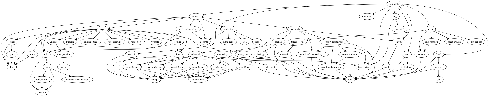

# LoLUpdater v3.1.0 for macOS
[Website](https://LoLUpdater.com)
## Usage
### With no arguments
Equivalent to `./lolupdater install "/Applications/League Of Legends.app"`.
### With one argument
Equivalent to `./lolupdater <argument> "/Applications/League Of Legends.app"`.
### With three arguments
`./lolupdater install <path>`

Runs LoLUpdater with LoL installed at `<path>`.

`./lolupdater uninstall <path>`

Removes LoLupdater for LoL installed at `<path>`.

## Dependency graph

